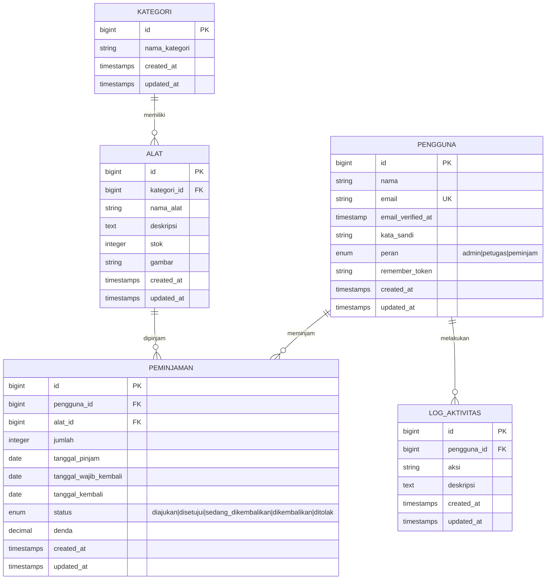
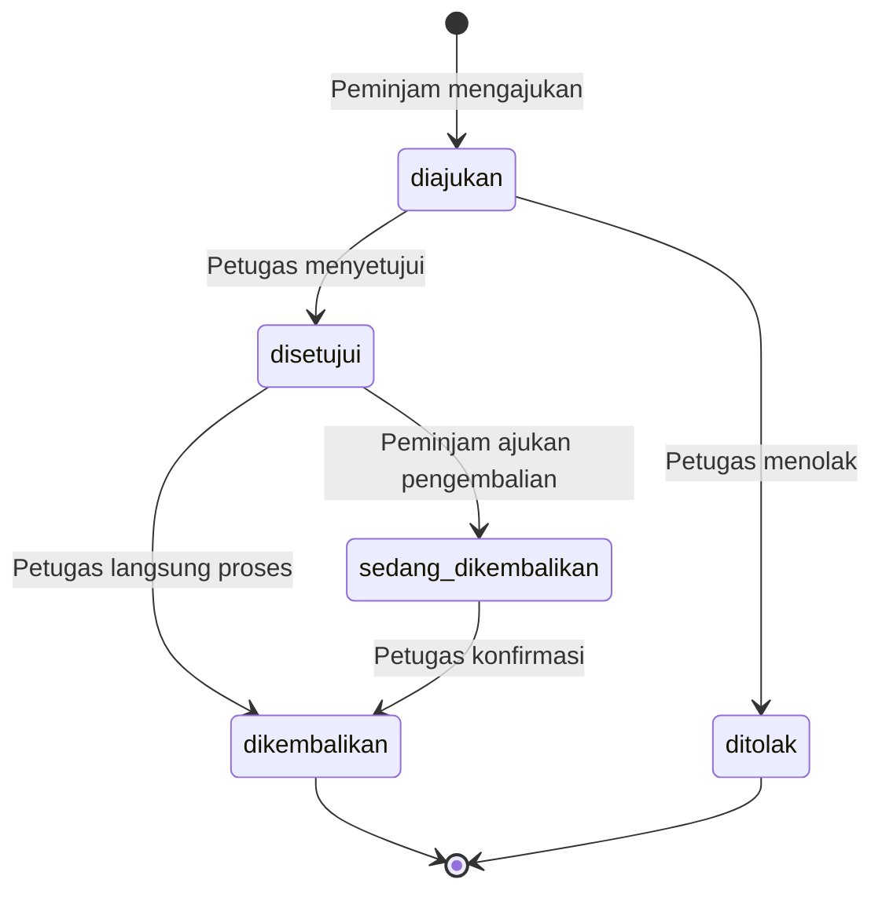

# 🛠️ Panduan Membuat Project "Aplikasi Peminjaman Alat" dari Nol

Panduan langkah demi langkah untuk membuat ulang project ini **tanpa bantuan AI**, murni manual.

---

## 📋 Daftar Isi

1. [Prasyarat (Software yang Dibutuhkan)](#1-prasyarat)
2. [Buat Project Laravel Baru](#2-buat-project-laravel-baru)
3. [Konfigurasi Environment (.env)](#3-konfigurasi-environment)
4. [Desain Database (ERD)](#4-desain-database-erd)
5. [Buat Migration](#5-buat-migration)
6. [Buat Model](#6-buat-model)
7. [Konfigurasi Autentikasi](#7-konfigurasi-autentikasi)
8. [Buat Middleware (Role-Based Access)](#8-buat-middleware)
9. [Buat Controller](#9-buat-controller)
10. [Konfigurasi Routing](#10-konfigurasi-routing)
11. [Buat Views (Blade Templates)](#11-buat-views)
12. [Buat Seeder (Data Dummy)](#12-buat-seeder)
13. [Setup Frontend (Tailwind CSS + Vite)](#13-setup-frontend)
14. [Storage Link untuk Upload Gambar](#14-storage-link)
15. [Jalankan Project](#15-jalankan-project)
16. [Ringkasan Struktur File](#16-ringkasan-struktur-file)

---

## 1. Prasyarat

Pastikan software berikut sudah terinstall di PC kamu:

| Software | Versi Minimum | Cara Cek | Download |
|----------|---------------|----------|----------|
| **PHP** | 8.2+ | `php -v` | [php.net](https://php.net) atau via XAMPP/Laragon |
| **Composer** | 2.x | `composer -V` | [getcomposer.org](https://getcomposer.org) |
| **Node.js** | 18+ | `node -v` | [nodejs.org](https://nodejs.org) |
| **MySQL** | 8.0+ | `mysql --version` | via XAMPP/Laragon/standalone |
| **Git** | apapun | `git --version` | [git-scm.com](https://git-scm.com) |

> [!TIP]
> **Rekomendasi untuk Windows**: Pakai **Laragon** (include PHP, MySQL, Composer dalam satu paket) atau **XAMPP**.

---

## 2. Buat Project Laravel Baru

### 2.1. Buat project via Composer

```bash
composer create-project laravel/laravel peminjaman
cd peminjaman
```

Ini akan membuat folder `peminjaman/` dengan struktur Laravel 11 lengkap.

### 2.2. Install dependencies Node.js

```bash
npm install
```

---

## 3. Konfigurasi Environment

### 3.1. Buat database MySQL

Buka MySQL (via phpMyAdmin, HeidiSQL, atau terminal):

```sql
CREATE DATABASE peminjaman;
```

### 3.2. Edit file `.env`

Buka file `.env` di root project, ubah bagian berikut:

```env
APP_NAME="Aplikasi Peminjaman Alat"
APP_TIMEZONE=Asia/Jakarta

APP_LOCALE=id
APP_FALLBACK_LOCALE=en
APP_FAKER_LOCALE=id_ID

DB_CONNECTION=mysql
DB_HOST=127.0.0.1
DB_PORT=3306
DB_DATABASE=peminjaman
DB_USERNAME=root
DB_PASSWORD=

SESSION_DRIVER=database
QUEUE_CONNECTION=database
CACHE_STORE=database
```

> [!IMPORTANT]
> `SESSION_DRIVER=database` artinya data sesi login disimpan di tabel database (bukan file). Ini penting karena migration default Laravel 11 sudah membuat tabel `sessions`.

---

## 4. Desain Database (ERD)

Sebelum coding, **rancang dulu struktur database**. Ini yang paling penting!

### Entity Relationship Diagram



### Alur Status Peminjaman



### Objek Database (Trigger, Function, Procedure)

Selain tabel, project ini juga membutuhkan:

| Objek | Nama | Fungsi |
|-------|------|--------|
| **Trigger** | `kurangi_stok_setelah_disetujui` | Otomatis kurangi stok saat status → `disetujui` |
| **Trigger** | `tambah_stok_setelah_dikembalikan` | Otomatis tambah stok saat status → `dikembalikan` |
| **Function** | `hitung_denda(tanggal_wajib, tanggal_kembali)` | Hitung denda Rp 5.000/hari keterlambatan |
| **Procedure** | `proses_persetujuan_peminjaman(id, id_petugas)` | Setujui + catat log dalam 1 transaksi |
| **Procedure** | `proses_pengembalian(id, id_petugas)` | Hitung denda + update status + catat log |

---

## 5. Buat Migration

Migration adalah file PHP yang mendefinisikan struktur tabel database. Jalankan sesuai urutan.

### 5.1. Migration Tabel Pengguna

Laravel 11 sudah membuat file migration default `0001_01_01_000000_create_users_table.php`. **Rename dan modifikasi** file ini:

```bash
# Rename file migration default
# dari: 0001_01_01_000000_create_users_table.php
# ke: 0001_01_01_000000_buat_tabel_pengguna.php
```

Edit isinya — ubah tabel `users` menjadi `pengguna`:

```php
<?php

use Illuminate\Database\Migrations\Migration;
use Illuminate\Database\Schema\Blueprint;
use Illuminate\Support\Facades\Schema;

return new class extends Migration
{
    public function up(): void
    {
        Schema::create('pengguna', function (Blueprint $table) {
            $table->id();
            $table->string('nama');
            $table->string('email')->unique();
            $table->timestamp('email_verified_at')->nullable();
            $table->string('kata_sandi');        // bukan 'password'
            $table->enum('peran', ['admin', 'petugas', 'peminjam'])
                  ->default('peminjam');
            $table->rememberToken();
            $table->timestamps();
        });

        Schema::create('password_reset_tokens', function (Blueprint $table) {
            $table->string('email')->primary();
            $table->string('token');
            $table->timestamp('created_at')->nullable();
        });

        Schema::create('sessions', function (Blueprint $table) {
            $table->string('id')->primary();
            $table->foreignId('user_id')->nullable()->index();
            $table->string('ip_address', 45)->nullable();
            $table->text('user_agent')->nullable();
            $table->longText('payload');
            $table->integer('last_activity')->index();
        });
    }

    public function down(): void
    {
        Schema::dropIfExists('pengguna');
        Schema::dropIfExists('password_reset_tokens');
        Schema::dropIfExists('sessions');
    }
};
```

> [!NOTE]
> **Kenapa `kata_sandi` bukan `password`?** Ini project berbahasa Indonesia. Nanti di Model kita override method `getAuthPassword()` supaya Laravel tetap bisa membaca kolom ini untuk autentikasi.

### 5.2. Buat Migration Kategori

```bash
php artisan make:migration buat_tabel_kategori
```

Isi file yang dibuat:

```php
Schema::create('kategori', function (Blueprint $table) {
    $table->id();
    $table->string('nama_kategori');
    $table->timestamps();
});
```

### 5.3. Buat Migration Alat

```bash
php artisan make:migration buat_tabel_alat
```

```php
Schema::create('alat', function (Blueprint $table) {
    $table->id();
    $table->foreignId('kategori_id')->constrained('kategori');  // FK ke tabel kategori
    $table->string('nama_alat');
    $table->text('deskripsi')->nullable();
    $table->integer('stok');
    $table->string('gambar')->nullable();
    $table->timestamps();
});
```

### 5.4. Buat Migration Peminjaman

```bash
php artisan make:migration buat_tabel_peminjaman
```

```php
Schema::create('peminjaman', function (Blueprint $table) {
    $table->id();
    $table->foreignId('pengguna_id')->constrained('pengguna');
    $table->foreignId('alat_id')->constrained('alat');
    $table->integer('jumlah')->default(1);
    $table->date('tanggal_pinjam');
    $table->date('tanggal_wajib_kembali');
    $table->date('tanggal_kembali')->nullable();
    $table->enum('status', [
        'diajukan',
        'disetujui',
        'sedang_dikembalikan',
        'dikembalikan',
        'ditolak'
    ])->default('diajukan');
    $table->decimal('denda', 10, 2)->default(0);
    $table->timestamps();
});
```

### 5.5. Buat Migration Log Aktivitas

```bash
php artisan make:migration buat_tabel_log_aktivitas
```

```php
Schema::create('log_aktivitas', function (Blueprint $table) {
    $table->id();
    $table->foreignId('pengguna_id')->constrained('pengguna')->onDelete('cascade');
    $table->string('aksi');
    $table->text('deskripsi')->nullable();
    $table->timestamps();
});
```

### 5.6. Buat Migration Trigger, Function & Procedure

```bash
php artisan make:migration buat_trigger_dan_prosedur
```

Ini yang paling kompleks. Kamu perlu menggunakan `DB::unprepared()` untuk menjalankan SQL mentah:

```php
<?php

use Illuminate\Database\Migrations\Migration;
use Illuminate\Support\Facades\DB;

return new class extends Migration
{
    public function up(): void
    {
        // --- TRIGGER 1: Kurangi stok saat peminjaman disetujui ---
        DB::unprepared('DROP TRIGGER IF EXISTS kurangi_stok_setelah_disetujui');
        DB::unprepared('
            CREATE TRIGGER kurangi_stok_setelah_disetujui AFTER UPDATE ON peminjaman
            FOR EACH ROW
            BEGIN
                IF NEW.status = "disetujui" AND OLD.status != "disetujui" THEN
                    UPDATE alat SET stok = stok - NEW.jumlah WHERE id = NEW.alat_id;
                END IF;
            END
        ');

        // --- TRIGGER 2: Tambah stok saat alat dikembalikan ---
        DB::unprepared('DROP TRIGGER IF EXISTS tambah_stok_setelah_dikembalikan');
        DB::unprepared('
            CREATE TRIGGER tambah_stok_setelah_dikembalikan AFTER UPDATE ON peminjaman
            FOR EACH ROW
            BEGIN
                IF NEW.status = "dikembalikan" AND OLD.status != "dikembalikan" THEN
                    UPDATE alat SET stok = stok + NEW.jumlah WHERE id = NEW.alat_id;
                END IF;
            END
        ');

        // --- FUNCTION: Hitung denda keterlambatan ---
        DB::unprepared('DROP FUNCTION IF EXISTS hitung_denda');
        DB::unprepared('
            CREATE FUNCTION hitung_denda(tanggal_wajib DATE, tanggal_kembali DATE) 
            RETURNS DECIMAL(10,2)
            DETERMINISTIC
            BEGIN
                DECLARE denda DECIMAL(10,2);
                DECLARE hari_terlambat INT;
                SET denda = 0;
                IF tanggal_kembali > tanggal_wajib THEN
                    SET hari_terlambat = DATEDIFF(tanggal_kembali, tanggal_wajib);
                    SET denda = hari_terlambat * 5000;
                END IF;
                RETURN denda;
            END
        ');

        // --- PROCEDURE 1: Proses persetujuan peminjaman ---
        DB::unprepared('DROP PROCEDURE IF EXISTS proses_persetujuan_peminjaman');
        DB::unprepared('
            CREATE PROCEDURE proses_persetujuan_peminjaman(IN id_peminjaman INT, IN id_petugas INT)
            BEGIN
                DECLARE EXIT HANDLER FOR SQLEXCEPTION ROLLBACK;
                START TRANSACTION;
                
                UPDATE peminjaman SET status = "disetujui" WHERE id = id_peminjaman;
                
                INSERT INTO log_aktivitas (pengguna_id, aksi, deskripsi, created_at, updated_at)
                VALUES (id_petugas, "Setujui Peminjaman", 
                        CONCAT("Peminjaman ", id_peminjaman, " disetujui"), NOW(), NOW());
                
                COMMIT;
            END
        ');

        // --- PROCEDURE 2: Proses pengembalian alat ---
        DB::unprepared('DROP PROCEDURE IF EXISTS proses_pengembalian');
        DB::unprepared('
            CREATE PROCEDURE proses_pengembalian(IN id_peminjaman INT, IN id_petugas INT)
            BEGIN
                DECLARE tanggal_wajib DATE;
                DECLARE nominal_denda DECIMAL(10,2);
                DECLARE EXIT HANDLER FOR SQLEXCEPTION ROLLBACK;
                START TRANSACTION;
                
                SELECT tanggal_wajib_kembali INTO tanggal_wajib 
                FROM peminjaman WHERE id = id_peminjaman;
                
                SET nominal_denda = hitung_denda(tanggal_wajib, CURDATE());
                
                UPDATE peminjaman 
                SET status = "dikembalikan", 
                    tanggal_kembali = CURDATE(), 
                    denda = nominal_denda 
                WHERE id = id_peminjaman;
                
                IF id_petugas IS NOT NULL THEN
                    INSERT INTO log_aktivitas (pengguna_id, aksi, deskripsi, created_at, updated_at)
                    VALUES (id_petugas, "Konfirmasi Pengembalian", 
                            CONCAT("Peminjaman ", id_peminjaman, " dikembalikan. Denda: ", nominal_denda), 
                            NOW(), NOW());
                END IF;
                
                COMMIT;
            END
        ');
    }

    public function down(): void
    {
        DB::unprepared('DROP TRIGGER IF EXISTS kurangi_stok_setelah_disetujui');
        DB::unprepared('DROP TRIGGER IF EXISTS tambah_stok_setelah_dikembalikan');
        DB::unprepared('DROP FUNCTION IF EXISTS hitung_denda');
        DB::unprepared('DROP PROCEDURE IF EXISTS proses_persetujuan_peminjaman');
        DB::unprepared('DROP PROCEDURE IF EXISTS proses_pengembalian');
    }
};
```

> [!IMPORTANT]
> **Urutan migration sangat penting!** File dijalankan berdasarkan urutan nama file (timestamp). Pastikan:
> 1. `pengguna` dibuat duluan (karena jadi FK di tabel lain)
> 2. `kategori` sebelum `alat` (karena `alat.kategori_id` merujuk ke `kategori`)
> 3. `alat` sebelum `peminjaman` (karena `peminjaman.alat_id` merujuk ke `alat`)
> 4. `log_aktivitas` dan trigger/procedure paling akhir

### 5.7. Jalankan Migration

```bash
php artisan migrate
```

---

## 6. Buat Model

Model adalah representasi PHP dari tabel database. Buat 5 model:

### 6.1. Model Pengguna (`app/Models/Pengguna.php`)

```bash
php artisan make:model Pengguna
```

```php
<?php

namespace App\Models;

use Illuminate\Database\Eloquent\Factories\HasFactory;
use Illuminate\Foundation\Auth\User as Authenticatable;  // PENTING: extends Authenticatable
use Illuminate\Notifications\Notifiable;

class Pengguna extends Authenticatable  // bukan extends Model!
{
    use HasFactory, Notifiable;

    protected $table = 'pengguna';  // nama tabel eksplisit

    protected $fillable = [
        'nama',
        'email',
        'kata_sandi',
        'peran',
    ];

    protected $hidden = [
        'password',
        'remember_token',
    ];

    // Override: beritahu Laravel bahwa kolom password bernama 'kata_sandi'
    public function getAuthPassword()
    {
        return $this->kata_sandi;
    }

    protected function casts(): array
    {
        return [
            'email_verified_at' => 'datetime',
            'password' => 'hashed',
            'kata_sandi' => 'hashed',  // auto-hash saat set value
        ];
    }
}
```

> [!WARNING]
> **Jangan lupa** — Model `Pengguna` harus `extends Authenticatable`, **bukan** `extends Model`. Ini agar Laravel bisa menggunakannya untuk login/logout. Dan override `getAuthPassword()` karena nama kolom kita bukan `password` tapi `kata_sandi`.

### 6.2. Model Kategori (`app/Models/Kategori.php`)

```bash
php artisan make:model Kategori
```

```php
<?php

namespace App\Models;

use Illuminate\Database\Eloquent\Factories\HasFactory;
use Illuminate\Database\Eloquent\Model;

class Kategori extends Model
{
    use HasFactory;

    protected $table = 'kategori';
    protected $fillable = ['nama_kategori'];

    // Relasi: satu kategori punya banyak alat
    public function alat()
    {
        return $this->hasMany(Alat::class);
    }
}
```

### 6.3. Model Alat (`app/Models/Alat.php`)

```bash
php artisan make:model Alat
```

```php
<?php

namespace App\Models;

use Illuminate\Database\Eloquent\Factories\HasFactory;
use Illuminate\Database\Eloquent\Model;

class Alat extends Model
{
    use HasFactory;

    protected $table = 'alat';

    protected $fillable = [
        'kategori_id',
        'nama_alat',
        'deskripsi',
        'stok',
        'gambar',
    ];

    // Relasi: alat dimiliki oleh satu kategori
    public function kategori()
    {
        return $this->belongsTo(Kategori::class);
    }

    // Relasi: satu alat bisa banyak peminjaman
    public function peminjaman()
    {
        return $this->hasMany(Peminjaman::class);
    }
}
```

### 6.4. Model Peminjaman (`app/Models/Peminjaman.php`)

```bash
php artisan make:model Peminjaman
```

```php
<?php

namespace App\Models;

use Illuminate\Database\Eloquent\Factories\HasFactory;
use Illuminate\Database\Eloquent\Model;

class Peminjaman extends Model
{
    use HasFactory;

    protected $table = 'peminjaman';

    protected $fillable = [
        'pengguna_id',
        'alat_id',
        'jumlah',
        'tanggal_pinjam',
        'tanggal_wajib_kembali',
        'tanggal_kembali',
        'status',
        'denda',
    ];

    public function pengguna()
    {
        return $this->belongsTo(Pengguna::class);
    }

    public function alat()
    {
        return $this->belongsTo(Alat::class);
    }
}
```

### 6.5. Model LogAktivitas (`app/Models/LogAktivitas.php`)

```bash
php artisan make:model LogAktivitas
```

```php
<?php

namespace App\Models;

use Illuminate\Database\Eloquent\Factories\HasFactory;
use Illuminate\Database\Eloquent\Model;

class LogAktivitas extends Model
{
    use HasFactory;

    protected $table = 'log_aktivitas';
    protected $fillable = ['pengguna_id', 'aksi', 'deskripsi'];

    public function pengguna()
    {
        return $this->belongsTo(Pengguna::class);
    }
}
```

---

## 7. Konfigurasi Autentikasi

### 7.1. Ubah Auth Provider

Edit file `config/auth.php` — ubah model default dari `User` ke `Pengguna`:

```php
'providers' => [
    'users' => [
        'driver' => 'eloquent',
        'model' => env('AUTH_MODEL', App\Models\Pengguna::class),  // <-- ubah ini
    ],
],
```

> [!NOTE]
> Ini memberitahu Laravel: "Saat melakukan autentikasi, cari data pengguna di model `Pengguna` (tabel `pengguna`), bukan di model `User` (tabel `users`)."

### 7.2. Hapus file `app/Models/User.php`

Karena kita tidak pakai tabel `users` bawaan Laravel, hapus model default:

```bash
del app\Models\User.php
```

---

## 8. Buat Middleware

Middleware adalah "filter" yang berjalan sebelum request sampai ke Controller.

### 8.1. Buat RoleMiddleware

```bash
php artisan make:middleware RoleMiddleware
```

Edit `app/Http/Middleware/RoleMiddleware.php`:

```php
<?php

namespace App\Http\Middleware;

use Closure;
use Illuminate\Http\Request;
use Symfony\Component\HttpFoundation\Response;
use Illuminate\Support\Facades\Auth;

class RoleMiddleware
{
    public function handle(Request $request, Closure $next, ...$roles): Response
    {
        // Cek sudah login
        if (!Auth::check()) {
            return redirect()->route('login');
        }

        $user = Auth::user();
        
        // Cek peran
        if (in_array($user->peran, $roles)) {
            return $next($request);  // Lanjut
        }

        // Redirect ke dashboard sesuai peran
        if ($user->peran === 'admin') {
            return redirect()->route('admin.dashboard');
        } elseif ($user->peran === 'petugas') {
            return redirect()->route('petugas.dashboard');
        } else {
            return redirect()->route('peminjam.dashboard');
        }
    }
}
```

### 8.2. Daftarkan Middleware

Edit `bootstrap/app.php` — tambahkan alias middleware:

```php
<?php

use Illuminate\Foundation\Application;
use Illuminate\Foundation\Configuration\Exceptions;
use Illuminate\Foundation\Configuration\Middleware;

return Application::configure(basePath: dirname(__DIR__))
    ->withRouting(
        web: __DIR__.'/../routes/web.php',
        commands: __DIR__.'/../routes/console.php',
        health: '/up',
    )
    ->withMiddleware(function (Middleware $middleware) {
        $middleware->alias([
            'peran' => \App\Http\Middleware\RoleMiddleware::class,  // <-- tambah ini
        ]);
    })
    ->withExceptions(function (Exceptions $exceptions) {
        //
    })->create();
```

> [!NOTE]
> Alias `'peran'` memungkinkan kita menulis `middleware('peran:admin')` di routes, yang lebih mudah dibaca daripada menulis nama class lengkap.

---

## 9. Buat Controller

### 9.1. AuthController — Login & Logout

```bash
php artisan make:controller AuthController
```

```php
<?php

namespace App\Http\Controllers;

use Illuminate\Http\Request;
use Illuminate\Support\Facades\Auth;

class AuthController extends Controller
{
    // Tampilkan form login
    public function showLoginForm()
    {
        return view('auth.login');
    }

    // Proses login
    public function login(Request $request)
    {
        $credentials = $request->validate([
            'email' => ['required', 'email'],
            'password' => ['required'],
        ]);

        if (Auth::attempt($credentials)) {
            $request->session()->regenerate();

            $peran = Auth::user()->peran;

            if ($peran === 'admin') {
                return redirect()->intended('/admin/dashboard');
            } elseif ($peran === 'petugas') {
                return redirect()->intended('/petugas/dashboard');
            } else {
                return redirect()->intended('/peminjam/dashboard');
            }
        }

        return back()->withErrors([
            'email' => 'Kredensial yang diberikan tidak cocok dengan catatan kami.',
        ])->onlyInput('email');
    }

    // Proses logout
    public function logout(Request $request)
    {
        Auth::logout();
        $request->session()->invalidate();
        $request->session()->regenerateToken();
        return redirect('/');
    }
}
```

> [!NOTE]
> **`Auth::attempt($credentials)`** — Laravel otomatis mencari pengguna berdasarkan `email`, lalu mencocokkan `password` dengan kolom yang dikembalikan oleh `getAuthPassword()` (yaitu `kata_sandi` yang sudah di-hash). Kamu tidak perlu menuliskan logika hashing manual.

### 9.2. KategoriController — CRUD Kategori

```bash
php artisan make:controller KategoriController --resource
```

Isi dengan logika CRUD standar: `index`, `create`, `store`, `edit`, `update`, `destroy`.

**Poin penting di `destroy()`**: Cek dulu apakah kategori masih punya alat sebelum dihapus:

```php
public function destroy(Kategori $kategori)
{
    if ($kategori->alat()->count() > 0) {
        return redirect()->route('admin.kategori.index')
            ->with('error', 'Kategori tidak bisa dihapus karena masih ada alat yang terdaftar.');
    }
    $kategori->delete();
    return redirect()->route('admin.kategori.index')->with('success', 'Kategori berhasil dihapus.');
}
```

### 9.3. AlatController — CRUD Alat + Upload Gambar

```bash
php artisan make:controller AlatController --resource
```

**Poin penting**: Upload gambar di `store()` dan `update()`:

```php
// Upload gambar di store()
if ($request->hasFile('gambar')) {
    $gambarPath = $request->file('gambar')->store('alat', 'public');
}

// Update gambar (hapus lama, simpan baru)
if ($request->hasFile('gambar')) {
    if ($alat->gambar && \Storage::disk('public')->exists($alat->gambar)) {
        \Storage::disk('public')->delete($alat->gambar);
    }
    $data['gambar'] = $request->file('gambar')->store('alat', 'public');
}
```

### 9.4. PenggunaController — CRUD Pengguna

```bash
php artisan make:controller PenggunaController --resource
```

**Poin penting**: Password di-hash saat `store()`, dan opsional saat `update()`:

```php
// Store - password wajib
Pengguna::create([
    'nama' => $request->nama,
    'email' => $request->email,
    'kata_sandi' => Hash::make($request->password),
    'peran' => $request->peran,
]);

// Update - password opsional
if ($request->filled('password')) {
    $data['kata_sandi'] = Hash::make($request->password);
}
```

### 9.5. PeminjamanController — Controller Utama

```bash
php artisan make:controller PeminjamanController
```

Ini controller terbesar, digunakan oleh 3 peran:

| Method | Peran | Fungsi |
|--------|-------|--------|
| `katalog()` | Peminjam | Lihat katalog alat (stok > 0) dengan filter kategori |
| `store()` | Peminjam | Ajukan peminjaman baru |
| `peminjamanSaya()` | Peminjam | Lihat riwayat peminjaman sendiri |
| `requestReturn()` | Peminjam | Ajukan pengembalian |
| `index()` | Petugas | Lihat semua peminjaman |
| `laporan()` | Petugas | Cetak laporan |
| `adminIndex()` | Admin | Lihat semua peminjaman |
| `approve()` | Petugas/Admin | Setujui peminjaman (via Stored Procedure) |
| `reject()` | Petugas/Admin | Tolak peminjaman |
| `returnTool()` | Petugas/Admin | Proses pengembalian (via Stored Procedure) |

**Poin kunci di `approve()`** — menggunakan Stored Procedure:

```php
public function approve(Peminjaman $peminjaman)
{
    if ($peminjaman->status !== 'diajukan') {
        return back()->with('error', 'Peminjaman tidak dalam status diajukan.');
    }

    if ($peminjaman->alat->stok < $peminjaman->jumlah) {
        return back()->with('error', 'Stok alat tidak mencukupi.');
    }

    // Panggil Stored Procedure
    DB::statement('CALL proses_persetujuan_peminjaman(?, ?)', [$peminjaman->id, Auth::id()]);
    
    return back()->with('success', 'Peminjaman disetujui.');
}
```

**Poin kunci di `store()`** — hitung tanggal wajib kembali:

```php
$tanggalPinjam = \Carbon\Carbon::parse($request->tanggal_pinjam);
$tanggalWajibKembali = $tanggalPinjam->copy()->addDays((int)$request->durasi);
```

### 9.6. LogAktivitasController — Read-Only

```bash
php artisan make:controller LogAktivitasController
```

```php
public function index()
{
    $log_aktivitas = LogAktivitas::with('pengguna')
        ->orderBy('created_at', 'desc')
        ->paginate(20);
    return view('admin.log_aktivitas.index', compact('log_aktivitas'));
}
```

---

## 10. Konfigurasi Routing

Edit `routes/web.php`:

```php
<?php

use Illuminate\Support\Facades\Route;
use App\Http\Controllers\AuthController;

// Redirect ke login
Route::get('/', fn() => redirect()->route('login'));

// Auth routes (guest only)
Route::middleware('guest')->group(function () {
    Route::get('login', [AuthController::class, 'showLoginForm'])->name('login');
    Route::post('login', [AuthController::class, 'login']);
});

Route::post('logout', [AuthController::class, 'logout'])->name('logout')->middleware('auth');

// === ADMIN ROUTES ===
Route::middleware(['auth', 'peran:admin'])->prefix('admin')->name('admin.')->group(function () {
    Route::get('/dashboard', fn() => view('admin.dashboard'))->name('dashboard');
    Route::resource('pengguna', \App\Http\Controllers\PenggunaController::class);
    Route::resource('kategori', \App\Http\Controllers\KategoriController::class);
    Route::resource('alat', \App\Http\Controllers\AlatController::class);
    Route::get('/log-aktivitas', [\App\Http\Controllers\LogAktivitasController::class, 'index'])->name('log_aktivitas.index');
    Route::get('/peminjaman', [\App\Http\Controllers\PeminjamanController::class, 'adminIndex'])->name('peminjaman.index');
    Route::post('/peminjaman/{peminjaman}/setujui', [\App\Http\Controllers\PeminjamanController::class, 'approve'])->name('peminjaman.approve');
    Route::post('/peminjaman/{peminjaman}/tolak', [\App\Http\Controllers\PeminjamanController::class, 'reject'])->name('peminjaman.reject');
    Route::post('/peminjaman/{peminjaman}/kembali', [\App\Http\Controllers\PeminjamanController::class, 'returnTool'])->name('peminjaman.return');
});

// === PETUGAS ROUTES ===
Route::middleware(['auth', 'peran:petugas'])->prefix('petugas')->name('petugas.')->group(function () {
    Route::get('/dashboard', fn() => view('petugas.dashboard'))->name('dashboard');
    Route::get('/peminjaman', [\App\Http\Controllers\PeminjamanController::class, 'index'])->name('peminjaman.index');
    Route::get('/laporan', [\App\Http\Controllers\PeminjamanController::class, 'laporan'])->name('laporan');
    Route::post('/peminjaman/{peminjaman}/setujui', [\App\Http\Controllers\PeminjamanController::class, 'approve'])->name('peminjaman.approve');
    Route::post('/peminjaman/{peminjaman}/tolak', [\App\Http\Controllers\PeminjamanController::class, 'reject'])->name('peminjaman.reject');
    Route::post('/peminjaman/{peminjaman}/kembali', [\App\Http\Controllers\PeminjamanController::class, 'returnTool'])->name('peminjaman.return');
});

// === PEMINJAM ROUTES ===
Route::middleware(['auth', 'peran:peminjam'])->prefix('peminjam')->name('peminjam.')->group(function () {
    Route::get('/dashboard', fn() => view('peminjam.dashboard'))->name('dashboard');
    Route::get('/katalog', [\App\Http\Controllers\PeminjamanController::class, 'katalog'])->name('alat.index');
    Route::post('/peminjaman', [\App\Http\Controllers\PeminjamanController::class, 'store'])->name('peminjaman.store');
    Route::get('/peminjaman-saya', [\App\Http\Controllers\PeminjamanController::class, 'peminjamanSaya'])->name('peminjaman.index');
    Route::post('/peminjaman/{peminjaman}/ajukan-pengembalian', [\App\Http\Controllers\PeminjamanController::class, 'requestReturn'])->name('peminjaman.return-request');
});
```

> [!NOTE]
> **Pola routing**: `prefix('admin')` artinya semua URL diawali `/admin/...`. `name('admin.')` artinya semua nama route diawali `admin.`. Jadi `Route::resource('alat', ...)` menghasilkan route `admin.alat.index`, `admin.alat.create`, dll.

---

## 11. Buat Views (Blade Templates)

### Struktur Folder Views

```
resources/views/
├── layouts/
│   └── app.blade.php              ← Layout utama (navbar + content area)
├── auth/
│   └── login.blade.php            ← Halaman login (standalone, tanpa layout)
├── admin/
│   ├── dashboard.blade.php        ← Dashboard admin
│   ├── pengguna/
│   │   ├── index.blade.php        ← Daftar pengguna + tabel
│   │   ├── create.blade.php       ← Form tambah pengguna
│   │   └── edit.blade.php         ← Form edit pengguna
│   ├── kategori/
│   │   ├── index.blade.php
│   │   ├── create.blade.php
│   │   └── edit.blade.php
│   ├── alat/
│   │   ├── index.blade.php
│   │   ├── create.blade.php
│   │   └── edit.blade.php
│   ├── peminjaman/
│   │   └── index.blade.php        ← Daftar peminjaman + tombol aksi
│   └── log_aktivitas/
│       └── index.blade.php        ← Daftar log aktivitas
├── petugas/
│   ├── dashboard.blade.php
│   ├── laporan.blade.php          ← Halaman cetak laporan
│   └── peminjaman/
│       └── index.blade.php
└── peminjam/
    ├── dashboard.blade.php
    ├── alat/
    │   └── index.blade.php        ← Katalog alat + form pinjam
    └── peminjaman/
        └── index.blade.php        ← Riwayat peminjaman + tombol pengembalian
```

### 11.1. Layout Utama (`layouts/app.blade.php`)

Ini template induk yang di-extend semua halaman:

```blade
<!DOCTYPE html>
<html lang="{{ str_replace('_', '-', app()->getLocale()) }}">
<head>
    <meta charset="utf-8">
    <meta name="viewport" content="width=device-width, initial-scale=1">
    <title>{{ config('app.name', 'Laravel') }}</title>
    @vite(['resources/css/app.css', 'resources/js/app.js'])
</head>
<body class="bg-gray-100 font-sans antialiased">
    <div class="min-h-screen">
        @auth
        <nav class="bg-white border-b border-gray-200">
            <div class="max-w-7xl mx-auto px-4 sm:px-6 lg:px-8">
                <div class="flex justify-between h-14">
                    <div class="flex items-center">
                        <a href="{{ url('/') }}" class="font-bold text-gray-800 text-lg">
                            Peminjaman Alat
                        </a>
                    </div>
                    <div class="flex items-center gap-6">
                        <span class="text-xs font-medium text-gray-500 uppercase">
                            {{ Auth::user()->nama }} | {{ Auth::user()->peran }}
                        </span>
                        <form method="POST" action="{{ route('logout') }}">
                            @csrf
                            <button type="submit" class="text-xs font-bold text-gray-400 hover:text-red-500">
                                Keluar
                            </button>
                        </form>
                    </div>
                </div>
            </div>
        </nav>
        @endauth

        <main class="py-10">
            <div class="max-w-7xl mx-auto sm:px-6 lg:px-8">
                @if(session('success'))
                    <div class="mb-4 bg-green-100 border border-green-400 text-green-700 px-4 py-3 rounded">
                        {{ session('success') }}
                    </div>
                @endif
                @if(session('error'))
                    <div class="mb-4 bg-red-100 border border-red-400 text-red-700 px-4 py-3 rounded">
                        {{ session('error') }}
                    </div>
                @endif
                
                @yield('content')
            </div>
        </main>
    </div>
</body>
</html>
```

### 11.2. Halaman Login (`auth/login.blade.php`)

```blade
<!DOCTYPE html>
<html lang="en">
<head>
    <meta charset="UTF-8">
    <meta name="viewport" content="width=device-width, initial-scale=1.0">
    <title>Masuk - Peminjaman Alat</title>
    @vite(['resources/css/app.css', 'resources/js/app.js'])
</head>
<body class="bg-gray-100 h-screen flex items-center justify-center">
    <div class="w-full max-w-md bg-white rounded-lg shadow-md p-8">
        <h2 class="text-2xl font-bold text-center text-gray-800 mb-8">Masuk Aplikasi</h2>
        
        <form method="POST" action="{{ route('login') }}">
            @csrf
            
            <div class="mb-4">
                <label for="email" class="block text-gray-700 text-sm font-bold mb-2">Alamat Email</label>
                <input type="email" name="email" id="email" 
                       class="shadow border rounded w-full py-2 px-3 text-gray-700 @error('email') border-red-500 @enderror" 
                       value="{{ old('email') }}" required autofocus>
                @error('email')
                    <p class="text-red-500 text-xs italic mt-1">{{ $message }}</p>
                @enderror
            </div>

            <div class="mb-6">
                <label for="password" class="block text-gray-700 text-sm font-bold mb-2">Kata Sandi</label>
                <input type="password" name="password" id="password" 
                       class="shadow border rounded w-full py-2 px-3 text-gray-700" required>
                @error('password')
                    <p class="text-red-500 text-xs italic mt-1">{{ $message }}</p>
                @enderror
            </div>

            <button type="submit" class="bg-blue-500 hover:bg-blue-700 text-white font-bold py-2 px-4 rounded w-full">
                Masuk
            </button>
        </form>
    </div>
</body>
</html>
```

### 11.3. Halaman-halaman Lainnya

Untuk setiap halaman lainnya, polanya sama:

```blade
@extends('layouts.app')

@section('content')
    {{-- Konten halaman di sini --}}
    {{-- Gunakan class Tailwind CSS untuk styling --}}
@endsection
```

**Tips penting saat membuat views**:

1. **Form harus ada `@csrf`** — Token keamanan wajib di setiap form POST.
2. **Form hapus pakai `@method('DELETE')`** — Karena HTML form hanya mendukung GET/POST.
3. **Tampilkan error validasi** — Pakai `@error('field_name')`.
4. **Notifikasi** — Sudah ditangani di layout (`session('success')` dan `session('error')`).
5. **Paginasi** — Pakai `{{ $data->links() }}` di bawah tabel.

---

## 12. Buat Seeder (Data Dummy)

Edit `database/seeders/DatabaseSeeder.php` untuk mengisi data awal.

**Urutan insert** (ikuti foreign key):
1. Pengguna (admin, petugas, peminjam)
2. Kategori
3. Alat
4. Peminjaman
5. Log Aktivitas

**Tips penting untuk seeder peminjaman**:
- Insert langsung pakai `DB::table('peminjaman')->insert(...)` untuk bypass trigger
- Kurangi stok manual untuk peminjaman yang berstatus `disetujui` dan `sedang_dikembalikan`
- Jangan pakai `Peminjaman::create()` karena trigger akan dieksekusi

Jalankan seeder:

```bash
php artisan db:seed
```

Atau fresh migrate + seed:

```bash
php artisan migrate:fresh --seed
```

**Akun login setelah seeding**:

| Peran | Email | Password |
|-------|-------|----------|
| Admin | `admin@admin.com` | `password` |
| Petugas | `budi.petugas@sekolah.com` | `password` |
| Peminjam | `andi.pratama@siswa.com` | `password` |

---

## 13. Setup Frontend (Tailwind CSS + Vite)

### 13.1. Install Tailwind CSS v4

```bash
npm install -D tailwindcss @tailwindcss/postcss autoprefixer
```

### 13.2. Buat `postcss.config.js`

```js
export default {
    plugins: {
        '@tailwindcss/postcss': {},
        autoprefixer: {},
    },
};
```

### 13.3. Buat `tailwind.config.js`

```js
/** @type {import('tailwindcss').Config} */
export default {
  content: [
    "./resources/**/*.blade.php",
    "./resources/**/*.js",
  ],
  theme: {
    extend: {},
  },
  plugins: [],
}
```

### 13.4. Edit `resources/css/app.css`

```css
@import "tailwindcss";
@config "../../tailwind.config.js";
```

### 13.5. Pastikan `vite.config.js` sudah benar

```js
import { defineConfig } from 'vite';
import laravel from 'laravel-vite-plugin';

export default defineConfig({
    plugins: [
        laravel({
            input: ['resources/css/app.css', 'resources/js/app.js'],
            refresh: true,
        }),
    ],
});
```

---

## 14. Storage Link

Untuk menampilkan gambar yang diupload, buat symbolic link:

```bash
php artisan storage:link
```

Ini membuat link `public/storage` → `storage/app/public` agar file di storage bisa diakses via URL.

Di view, tampilkan gambar dengan:

```blade
gambar) }}" alt="{{ $alat->nama_alat }}">
```

---

## 15. Jalankan Project

Buka **2 terminal** terpisah:

**Terminal 1 — Laravel server**:
```bash
php artisan serve
```

**Terminal 2 — Vite dev server** (untuk hot reload CSS/JS):
```bash
npm run dev
```

Buka browser: **http://localhost:8000**

---

## 16. Ringkasan Struktur File

```
peminjaman/
├── app/
│   ├── Http/
│   │   ├── Controllers/
│   │   │   ├── AuthController.php          ← Login/Logout
│   │   │   ├── KategoriController.php      ← CRUD Kategori
│   │   │   ├── AlatController.php          ← CRUD Alat + Upload Gambar
│   │   │   ├── PenggunaController.php      ← CRUD Pengguna
│   │   │   ├── PeminjamanController.php    ← Semua logic peminjaman
│   │   │   └── LogAktivitasController.php  ← Lihat log aktivitas
│   │   └── Middleware/
│   │       └── RoleMiddleware.php          ← Cek peran pengguna
│   └── Models/
│       ├── Pengguna.php                    ← extends Authenticatable
│       ├── Kategori.php
│       ├── Alat.php
│       ├── Peminjaman.php
│       └── LogAktivitas.php
├── bootstrap/
│   └── app.php                             ← Register middleware alias 'peran'
├── config/
│   └── auth.php                            ← Model auth = Pengguna
├── database/
│   ├── migrations/                         ← 6 file migration
│   └── seeders/
│       └── DatabaseSeeder.php              ← Data dummy lengkap
├── resources/
│   ├── css/app.css                         ← Import Tailwind
│   └── views/                              ← 20+ file Blade
├── routes/
│   └── web.php                             ← Semua route aplikasi
├── .env                                    ← Konfigurasi lokal
├── postcss.config.js
├── tailwind.config.js
└── vite.config.js
```

---

## 🎯 Checklist Pengerjaan

Gunakan checklist ini untuk melacak progress:

- [ ] Install PHP, Composer, Node.js, MySQL
- [ ] `composer create-project laravel/laravel peminjaman`
- [ ] Buat database MySQL `peminjaman`
- [ ] Edit `.env` (DB, timezone, locale)
- [ ] Buat & jalankan 6 migration
- [ ] Buat 5 model (dengan relasi)
- [ ] Edit `config/auth.php` → model Pengguna
- [ ] Hapus `app/Models/User.php`
- [ ] Buat `RoleMiddleware` + daftarkan di `bootstrap/app.php`
- [ ] Buat 6 controller
- [ ] Tulis semua route di `web.php`
- [ ] Install Tailwind CSS + konfigurasi
- [ ] Buat layout utama `layouts/app.blade.php`
- [ ] Buat halaman login `auth/login.blade.php`
- [ ] Buat 3 dashboard (admin, petugas, peminjam)
- [ ] Buat halaman CRUD pengguna (index, create, edit)
- [ ] Buat halaman CRUD kategori (index, create, edit)
- [ ] Buat halaman CRUD alat (index, create, edit)
- [ ] Buat halaman peminjaman (admin + petugas)
- [ ] Buat halaman katalog peminjam
- [ ] Buat halaman riwayat peminjaman
- [ ] Buat halaman log aktivitas
- [ ] Buat halaman laporan (cetak)
- [ ] Buat DatabaseSeeder dengan data dummy
- [ ] `php artisan migrate:fresh --seed`
- [ ] `php artisan storage:link`
- [ ] Test login semua peran
- [ ] Test alur peminjaman lengkap

---

> [!TIP]
> **Urutan yang disarankan**: Database → Model → Auth Config → Middleware → Controller → Routes → Views → Seeder → Test. Selalu mulai dari **backend** ke **frontend**.
