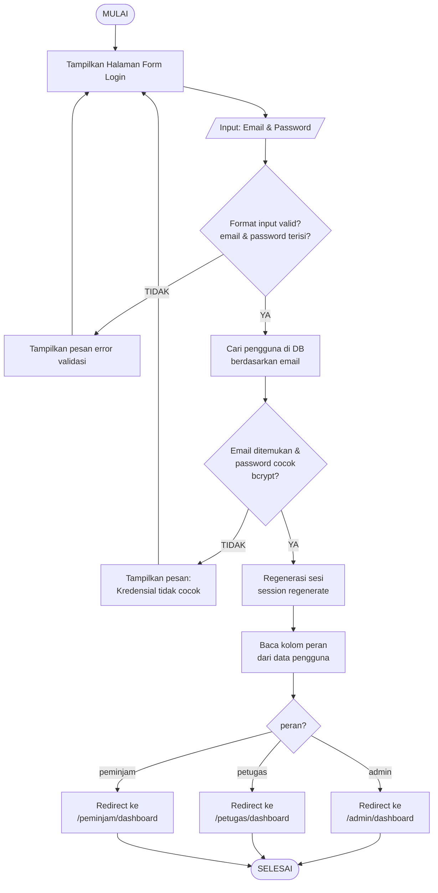
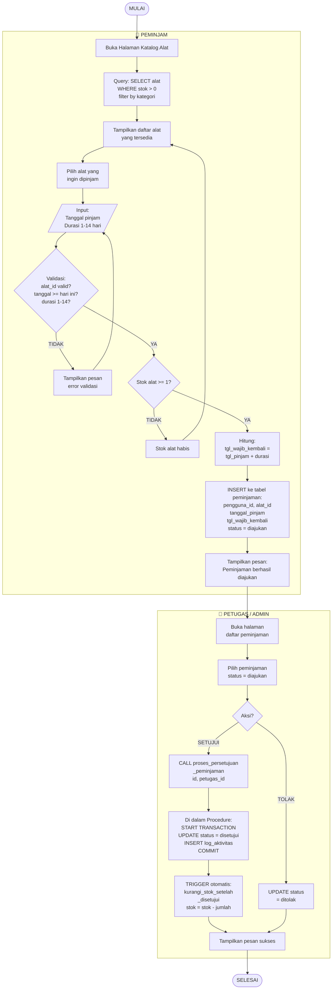
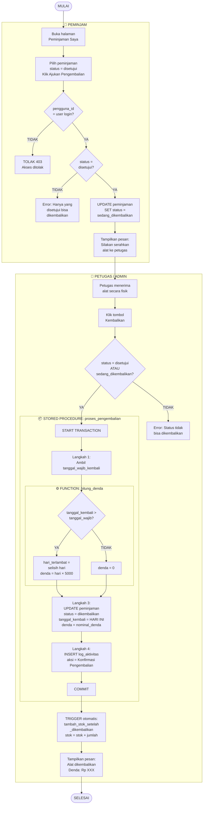

# Flowchart untuk Draw.io (diagrams.net)

## Cara Menggunakan:

### Metode 1: Import Mermaid (Paling Mudah)
1. Buka **https://app.diagrams.net/**
2. Klik **Extras** → **Edit Diagram** (atau tekan Ctrl+Shift+X)
3. Ganti isi dengan XML di bawah
4. Klik **OK** → Diagram otomatis muncul

### Metode 2: Mermaid Live Editor → Export
1. Buka **https://mermaid.live/**
2. Paste kode Mermaid di bawah
3. Klik **Actions** → **Export as PNG/SVG**
4. Atau copy kode ke draw.io via: **Insert** → **Advanced** → **Mermaid**

---

## A. Flowchart Login



---

## B. Flowchart Peminjaman Alat



---

## C. Flowchart Pengembalian Alat & Denda



---

## Tips di Draw.io:

1. **Import via Mermaid**: Klik menu **Insert** → **Advanced** → **Mermaid...**
2. Paste salah satu kode `mermaid` di atas (tanpa tanda ``` )
3. Klik **Insert** → Diagram otomatis ter-render
4. Bisa di-edit visual setelahnya (drag, resize, warna)
5. Export sebagai **PNG**, **SVG**, atau **PDF**
